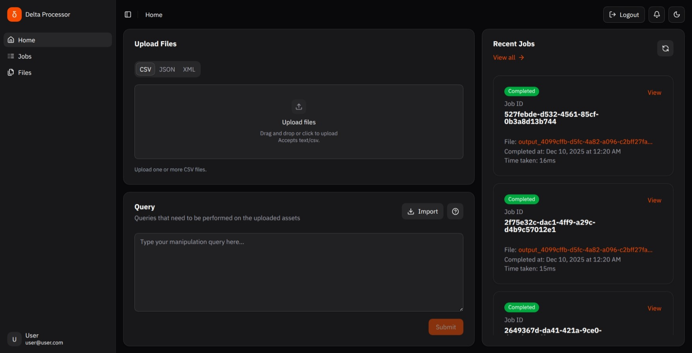
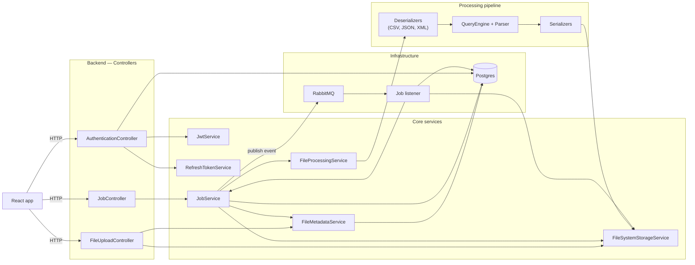

# File Processor

A full-stack application that allows users to upload, process, and query files in various formats (CSV, JSON, XML). The application consists of a React frontend and a Spring Boot backend.

## Screenshots




## Project Structure

```
├── client/              # Frontend React application with Vite
│   ├── src/
│   │   ├── components/ # React components
│   │   ├── hooks/      # Custom React hooks
│   │   ├── lib/        # Utility functions and API handlers
│   │   └── routes/     # Application routes
│   └── ...
└── server/             # Backend Spring Boot application
    └── src/
        └── main/
            ├── java/   # Java source files
            └── resources/ # Application properties and DB migrations
```

## Architecture diagram

Below is a high-level architecture diagram showing how the frontend, controllers, services, queue, storage and the database interact.



## Features

- User authentication and authorization
- File upload and processing support for multiple formats (CSV, JSON, XML)
- Custom query engine for processing uploaded files
- Job management system with RabbitMQ for async processing
- Modern UI with Shadcn components
- Responsive design with mobile support

## Tech Stack

### Frontend

- React with TypeScript
- Vite for build tooling
- TanStack Router for routing
- Shadcn UI components
- Zustand for state management

### Backend

- Spring Boot
- Spring Security with JWT authentication
- RabbitMQ for message queue
- Flyway for database migrations
- JPA/Hibernate for database operations

## Getting Started

### Prerequisites

- Node.js
- Java 17 or higher
- Maven
- RabbitMQ server
- PostgreSQL database

### Frontend Setup

```bash
cd client
npm install
npm run dev
```

The frontend will be available at `http://localhost:5173`

### Backend Setup

```bash
cd server
./mvnw spring-boot:run
```

The backend API will be available at `http://localhost:8080`

## Database Setup

The application uses Flyway migrations to set up the database schema. Make sure you have PostgreSQL running and update the database configuration in `server/src/main/resources/application.yml`.

## Environment Variables

### Frontend

Create a `.env` file in the client directory:

```env
VITE_API_URL=http://localhost:8080
```

### Backend

Update `application.yml` with your configuration:

```yaml
spring:
  datasource:
    url: jdbc:postgresql://localhost:5432/your_database
    username: your_username
    password: your_password
```

## License

[MIT License](LICENSE)
